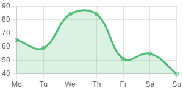

<p align="center">
  <a href="https://coreui.io/">
    
  </a>
</p>

<h3 align="center">CoreUI Angular wrapper for Chart.js</h3>

<p align="center">
  <a href="https://coreui.io/angular/docs/"><strong>Explore @coreui/angular-chartjs docs & examples »</strong></a>
  <br>
  <br>
  <a href="https://github.com/coreui/coreui-angular/issues/new?template=bug_report.md">Report bug</a>
  ·
  <a href="https://github.com/coreui/coreui-angular/issues/new?template=feature_request.md">Request feature</a>
  ·
  <a href="https://blog.coreui.io/">Blog</a>
</p>

## Status

[![npm package][npm-badge]][npm]
[![NPM downloads][npm-download]][npm]
![angular][angular-badge]

[npm-badge]: https://img.shields.io/npm/v/@coreui/angular-chartjs/latest?style=flat-square
[npm]: https://www.npmjs.com/package/@coreui/angular-chartjs
[npm-download]: https://img.shields.io/npm/dm/@coreui/angular-chartjs.svg?style=flat-square
[angular-badge]: https://img.shields.io/badge/angular-^13.3.0-lightgrey.svg?style=flat-square&logo=angular

##### install:

```bash
npm install chart.js
npm install @coreui/chartjs@3
npm install @coreui/angular-chartjs
````

##### import:

```ts
import { ChartjsModule } from '@coreui/angular-chartjs';

@NgModule({
  imports: [
      ChartjsModule,
...
```

##### usage:

```tsx
@Component({
  selector: 'app-chart-sample',
  template: `<c-chart type="line" [data]="data" [options]="options" width="300"></c-chart>`,
})
export class ChartSample {

  colors = {
    label: 'My dataset',
    backgroundColor: 'rgba(77,189,116,.2)',
    borderColor: '#4dbd74',
    pointHoverBackgroundColor: '#fff',
  }

  labels = ['Mo', 'Tu', 'We', 'Th', 'Fr', 'Sa', 'Su'];

  data = {
    labels: this.labels,
    datasets: [{
      data: [65, 59, 84, 84, 51, 55, 40],
      ...this.colors,
      fill:  {value: 65}
    }],
  }

  options = {
    plugins: {
      legend: {
        display: false
      }
    },
    maintainAspectRatio: false,
    elements: {
      line: {
        tension: 0.4
      },
    }
  };
}
```



### c-chart
_component_

##### Inputs:

|name|description|type|default|
|---|---|---|---|
|`customTooltips`|Enables custom html based tooltips|`boolean`|_true_
|`data`|The data passed to Chart.js chart|[`ChartData`](https://www.chartjs.org/docs/latest/api/interfaces/ChartData.html)|**required**
|`options`|The options object that is passed into the Chart.js chart|[`ChartOptions`](https://www.chartjs.org/docs/latest/general/options.html)|_undefined_
|`plugins`|The plugins array that is passed into the Chart.js chart|[`PluginOptionsByType`](https://www.chartjs.org/docs/latest/api/interfaces/PluginOptionsByType.html)|_undefined_
|`redraw`|If true, will tear down and redraw chart on all updates|`boolean`|_false_
|`type`|Chart.js chart type.|[`keyof ChartTypeRegistry`](https://www.chartjs.org/docs/latest/api/interfaces/ChartTypeRegistry.html)|_bar_
|`wrapper`|Put the chart into the wrapper with `display: block`.|`boolean`|_true_
|`height`|Height attribute applied to the rendered canvas (px)|`number`|_undefined_
|`width`|Width attribute applied to the rendered canvas (px)|`number`|_undefined_
|`id`|Html id attribute applied to the rendered canvas|`string`|_undefined_

##### Outputs:

|name|description|
|---|---|
|`getDatasetAtEvent`|Proxy for Chart.js getDatasetAtEvent. Calls with dataset and triggering event.
|`getElementAtEvent`|Proxy for Chart.js getElementAtEvent. Calls with single element array and triggering event.
|`getElementsAtEvent`|Proxy for Chart.js getElementsAtEvent. Calls with element array and triggering event.


### See also:

- Chart.js docs [https://www.chartjs.org/docs/](https://www.chartjs.org/docs/)
